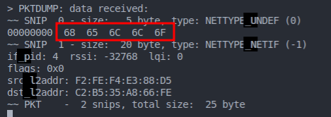
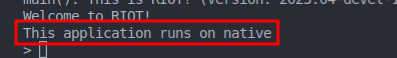
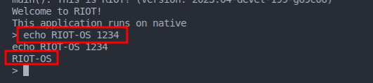

# Woche 1

## Challenge 1: VM installation

Das VM setup wird hier nicht genauer beschrieben.

## Challenge 2: Erste schritte mit RIOT

Die Anleitung zum Setup von RIOT OS aus den RIOT Tutorials wurde durchlaufen und ein funktionierender Workspace erstellt.

Wir haben das Setup insofern verändert, dass unser Code in einem separaten Ordner neben dem von GitHub geklonten RIOT Dateien liegt.

### First_test Application

Das Ziel ist ein erstes RIOT-OS selber zu kompilieren, mit einer eigen Funktion zu versehen und zu starten.

Im default Makefile müssen zwei Änderungen vorgenommen werden:
1. In der Variable `APPLICATION` der Name der Ausführbaren binary zu setzen
2. Die `RIOTBASE`, dem Pfad zu den Hauptdateien des RIOT-OS, zu setzen.

Es soll eine shell command geschrieben werden der bei Aufruf einen String aufgibt.
Zugrunde liegt eine einfache C Funktion mit einem `printf()` statement:

Des weiteren muss die Funktion in einem Array eingetragen und dieses Array als Quelle für Shell-befehle in der `main` Funktion registriert werden.

Nun kann mithilfe des `make`-Kommandos ein build gestartet werden und die resultierende Binary mit dem Namen **First_test.elf** ausgeführt werden.
In der RIOT Shell kann nun der Befehl `whats_up` ausgeführt werden.

### Simple Network communication

Das Ziel dieser Challenge war, zwei RIOT-OS Instanzen über Netzwerk kommunizieren zu lassen.

Das im RIOT Repo mitgelieferte Script `tapsetup` kann genutzt werden um in der Linux Umgebung zwei interfaces (tap0 und tap1) anzulegen.

Wird nun eine RIOT-OS Instanz mit dem Zusatz `PORT=tap0` ist das INterface tap0 Verbunden und kann intern mit dem Befehl `ifconfig` gefunden werden. Neben dem Interface wird die Hardware-Adresse auf der das Interface später angesprochen werden kann angezeigt.

Nun kann mit Hilfe des Befehls `txtsnd 4 C2:B5:35:A8:66:FE hello` eine Nachricht an ein anderes Interface gesendet werden.
Der Befehl beinhaltet:
1. Die Interface Nummer auf der gesendet werden soll
2. Die Hardware Adresse des Ziels 
3. Die Nachricht

Auf dem zweiten Instanz kann kann die gesendete Nachricht nun in Hexadezimaler Form empfangen werden.

# Woche 2

## Challenge 1
Das Ziel ist die ersten vier Tutorials von RIOT durchzuarbeiten

### Task 01
Einfügen der Code-Zeile `printf("This application runs on %s\n", RIOT_BOARD);` gibt den Hardware Typ aud für den RIOT Kompiliert wurde.

### Task 02
Die Funktion `echo()` aus dem Tutorial Code muss um die Zeile ` printf("%s", argv[1]);` erweitert werden, um das erste Argument der Funktion zu auszugeben.

### Task 03

## Challenge 2

## Challenge 3

### Review AES-CBC
Im AES-CBC
