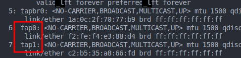

# Woche 1

## Challenge 1: VM installation

Das VM setup wird hier nicht genauer beschrieben.

## Challenge 2: Erste schritte mit RIOT

Die Anleitung zum Setup von RIOT OS aus den RIOT Tutorials wurde durchlaufen und ein funktionierender Workspace erstellt.

Wir haben das Setup insofern verändert, dass unser Code in einem separaten Ordner neben dem von GitHub geklonten RIOT Dateien liegt.

### First_test Application

Das Ziel ist ein erstes RIOT-OS selber zu kompilieren, mit einer eigen Funktion zu versehen und zu starten.

Im default Makefile müssen zwei Änderungen vorgenommen werden:
1. In der Variable `APPLICATION` der Name der Ausführbaren binary zu setzen
2. Die `RIOTBASE`, dem Pfad zu den Hauptdateien des RIOT-OS, zu setzen.

Es soll eine shell command geschrieben werden der bei Aufruf einen String aufgibt.
Zugrunde liegt eine einfache C Funktion mit einem `printf()` statement:

Des weiteren muss die Funktion in einem Array eingetragen und dieses Array als Quelle für Shell-befehle in der `main` Funktion registriert werden.

Nun kann mithilfe des `make`-Kommandos ein build gestartet werden und die resultierende Binary mit dem Namen **First_test.elf** ausgeführt werden.
In der RIOT Shell kann nun der Befehl `whats_up` ausgeführt werden.

### Simple Network communication

Das Ziel dieser Challenge war, zwei RIOT-OS Instanzen über Netzwerk kommunizieren zu lassen.

Das im RIOT Repo mitgelieferte Script `tapsetup` kann genutzt werden um in der Linux Umgebung zwei interfaces (tap0 und tap1) anzulegen.

Wird nun eine RIOT-OS Instanz mit dem Zusatz `PORT=tap0` ist das INterface tap0 Verbunden und kann intern mit dem Befehl `ifconfig` gefunden werden. Neben dem Interface wird die Hardware-Adresse auf der das Interface später angesprochen werden kann angezeigt.

Nun kann mit Hilfe des Befehls `txtsnd 4 32:7E:98:37:38:94 hello` eine Nachricht an ein anderes Interface gesendet werden.
Der Befehl beinhaltet:
1. Die Interface Nummer auf der gesendet werden soll
2. Die Hardware Adresse des Ziels 
3. Die Nachricht

# Woche 2

## Challenge 4

### 4.2.: Understanding existing benchmarking code

Die Funktion "executeAesCbc()" in  aes-cbc.c nimmt drei Parameter entgegen: numberOfRounds, keySize und messageLength. Sie führt dann AES-CBC für die angegebene Anzahl von Runden wie folgt aus:

- Jede Runde generiert die Funktion eine zufällige Plaintext-Nachricht. Dann erzeugt sie einen zufälligen Initialisierungsvektor (IV). Danach wird das AES-Chiffrierobjekt mit einem zufällig erzeugten Chiffrierschlüssel initialisiert.
- Der Verschlüsselungsprozess wird mit der Funktion cipher_encrypt_cbc durchgeführt, die den IV, den Plaintext und den outputBuffer als Eingabe erhält.
- Der Entschlüsselungsprozess wird mit cipher_decrypt_cbc durchgeführ und erhällt wie eben IV, Output der encrypt-Funktion und den decryptBuffer
- Zum Ende werden jeweils die Rundenzeiten für encrypt und decrypt ausgegeben.

Die Funktion "executeAesEcb()" in aes-ecb.c ist gleich aufgebaut, wie die obere:
Beide Funktionen erzeugen zufällige Eingabedaten und Verschlüsselungsschlüssel und führen die Ver- und Entschlüsselung durch, wobei der einzige Unterschied in der Art des verwendeten Algorithmus besteht (CBC vs. ECB).