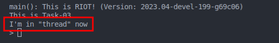

# Woche 1

## Challenge 1: VM installation

Das VM setup wird hier nicht genauer beschrieben.

## Challenge 2: Erste schritte mit RIOT

Die Anleitung zum Setup von RIOT OS aus den RIOT Tutorials wurde durchlaufen und ein funktionierender Workspace erstellt.

Wir haben das Setup insofern verändert, dass unser Code in einem separaten Ordner neben dem von GitHub geklonten RIOT Dateien liegt.

### First_test Application

Das Ziel ist ein erstes RIOT-OS selber zu kompilieren, mit einer eigen Funktion zu versehen und zu starten.

Im default Makefile müssen zwei Änderungen vorgenommen werden:

1. In der Variable `APPLICATION` der Name der Ausführbaren binary zu setzen

2. Die `RIOTBASE`, dem Pfad zu den Hauptdateien des RIOT-OS, zu setzen.

```
...
APPLICATION = First_test

BOARD ?= native

RIOTBASE ?= $(CURDIR)/../../../RIOT/
...
```

Es soll eine Shell Kommando geschrieben werden das bei Aufruf einen String zurück gibt.
Zugrunde liegt eine einfache C Funktion mit einem `printf()` statement:

```
static int whats_up(int argc, char **argv) {
    (void)argc;
    (void)argv;

    printf("The roof!\n");
    return 0;
}
```

Des weiteren muss die Funktion in einem Array eingetragen und dieses Array als Quelle für Shell-befehle in der `main` Funktion registriert werden.

```
const shell_command_t shell_commands[] = {
    {"whats_up", "prints the roof", whats_up},
    { NULL, NULL, NULL}
};
```

```
shell_run(shell_commands, line_buf, SHELL_DEFAULT_BUFSIZE);
```

Nun kann mithilfe des `make`-Kommandos ein build gestartet werden und die resultierende Binary mit dem Namen **First_test.elf** ausgeführt werden.
In der RIOT Shell kann nun der Befehl `whats_up` ausgeführt werden.


### Einfache Netzwerk Kommunikation
Das Ziel dieser Challenge war, zwei RIOT-OS Instanzen über Netzwerk kommunizieren zu lassen.

Das im RIOT Repo mitgelieferte Script `tapsetup` kann genutzt werden um in der Linux Umgebung zwei interfaces (tap0 und tap1) anzulegen.


Wird nun eine RIOT-OS Instanz mit dem Zusatz `PORT=tap0` ist das INterface tap0 Verbunden und kann intern mit dem Befehl `ifconfig` gefunden werden. Neben dem Interface wird die Hardware-Adresse auf der das Interface später angesprochen werden kann angezeigt.


Nun kann mit Hilfe des Befehls `txtsnd 4 C2:B5:35:A8:66:FE hello` eine Nachricht an ein anderes Interface gesendet werden.
Der Befehl beinhaltet:

   1. Die Interface Nummer auf der gesendet werden soll

   2. Die Hardware Adresse des Ziels 

   3. Die Nachricht

Auf dem zweiten Instanz kann kann die gesendete Nachricht nun in Hexadezimaler Form empfangen werden.


# Woche 2

## Challenge 1
Das Ziel ist die ersten vier Tutorials von RIOT durchzuarbeiten

### Task 01
Einfügen der Code-Zeile `printf("This application runs on %s\n", RIOT_BOARD);` gibt den Hardware Typ aud für den RIOT Kompiliert wurde.


### Task 02
Die Funktion `echo()` aus dem Tutorial Code muss um die Zeile ` printf("%s", argv[1]);` erweitert werden, um das erste Argument der Funktion zu auszugeben.


### Task 03

Zum erstellen eines Threads muss die Multithreading library importiert und ein Array als Stack für den Thread erstellt werden.

```
...
#include "thread.h"

char rcv_thread_stack[THREAD_STACKSIZE_MAIN];
...
```

Jetzt kann mit `thread_create()` ein neuer Thread erstellt werden. Die Parameter enthalten eine Referenz auf den Stack und die Funktion die aufgerufen werden soll,, diese wurde im Tutorial Code vorgegeben.



### Task 04

Um Timer in RIOT-OS Nutzen zu Können muss im Makefile das Modul **xtimer** importiert werden: `USEMODULE += xtimer`

In einem Thread wird nun mit `xtimer_now_usec()` die aktuelle Systemzeit in Millisekunden Ausgegeben und dann mit `xtimer_sleep(2)` zwei Sekunden geschlafen.

```
...
void *system_time(void *arg)
{
    int time = 0;
    while(true){
        time = xtimer_now_usec();
        printf("%d \n",time);
        xtimer_sleep(2);
    }

    (void)arg;
    return NULL;
}
...
```

## Challenge 2
In Chapter_2_Crypto wurden die beiden AES modes ECB und CBC erfolgreich kompiliert und eine Test message verschlüsselt und entschlüsselt. Dafür wurde der BASE_PFAD im Makefile angepasst und in der main() je der CIPHER_AES_128 zu CIPHER_AES geändert und den `include shell_commands` entfernt, da sie deprecated sind.

## Challenge 3

### Review AES-CBC
Unter Chapter_2_Crypto befindet sich die Dokumentation zu 05_AES_CBC_en.md. Zu Beginn werden die Module cipher_modes (Für die verschiedenen AES cipher modes) und random (zur Generierung der IV) zum makefile hinzugefügt. Anschließend werden die zwei header Dateien für die Verschlüsselungs- und Entschlüsselungsmethoden vom CBC Mode hinzugefügt.


Für die Generierung eines cipher textes c1 Im CBC Mode wird der Plaintext mit der IV xor verknüpft und anschließend mit dem key verschlüsselt. Die IV ist dabei zufällig. Für den nächsten cipher text c2, dient c1 als IV.

Im main code wird nun zunächst ein Schlüssel, die message (plaintext) und cipher initialisiert. Anschließend folgen buffer Initialisierungen für input, output und decrypt. 

Die IV ist eine zufällige, 16 byte große Zahl. Hier ist ein Verweis, dass man im productive mode einen kryptographischen Random Number Generator benutzen sollte, da die IV für jeden cipher text einzigartig sein muss. 

Nun werden die encrypt_cbc und decrypt_cbc Methoden aufgerufen.

### Additional Block Cipher Mode: CTR 
In diesem Abschnitt wird der Code der obigen Review (AES CBC) zu AES_CTR abgeändert.


Dafür definieren wir die folgenden Begriffe:
- Nonce: Ist eine unique number. Diese wird oft Synonym mit der IV aus den anderen AES modes benutzt. 
- Counter: Eine weitere unique number, welche in nachfolgenden Runden mit einer Inkrementier-Methode inkrementiert wird.
- Counter Block: Ist die nonce konkatiert mit dem counter.

Der Counter Block ist wie die IV aus dem AES-CBC 16 byte groß, also 128 bit. Dieser muss in zwei Teile geteilt werden für die Nonce + Counter. Auf den initialen Counter wird eine Inkrementierungsmethode angewandt, diese ist standardmäsig: (Counter+1 mod 2^Counter_Block_length). In NIST-SP800-38A Appendix B.2 ist eine der  Herangehensweisen zur Initialisierung des Counter Blocks, dass die Nonce und der Counter genau die Hälfte des Counter Blocks einnehmen. Deswegen wählen wir eine 64 bit Nonce und einen 64 bit Counter. Diese werden wie in der Review des AES-CBC mit einer random number initialisiert, wobei in der Praxis ein kryptographisch sicherer Random Number Generator benutzt werden sollte.

Der Counterblock wird unter Verwendung des Keys mit einer AES encryption function verschlüsselt, um einen Keystream zu erzeugen, der dann mit dem Plaintext XOR-verknüpft wird, um den Ciphertext zu erzeugen. Also anders wie im CBC Mode, wo erst eine XOR-Verknüpfung des Plaintext mit der IV und anschließend eine Verschlüsselung stattfindet, wird bei CTR der Counter Block verschlüsselt und anschließend eine XOR-Verknüfung mit dem Plaintext durchgeführt.

Für die Implementierung werden die Header Dateien mit den cipher_encrypt_ctr und cipher_decrypt_ctr hinzugefügt:
```
encrypt ctr
int cipher_encrypt_ctr(const cipher_t *cipher, uint8_t counter_block, 8, const uint8_t *input, size_t input_len, uint8_t *output);

//decrypt ctr
int cipher_decrypt_ctr(const cipher_t *cipher, uint8_t counter_block, 8, const uint8_t *input, size_t input_len, uint8_t *output);
```

Entsprechend werden folgende Zeilen des CBC-Codes für die main abgeändert:

- Anstatt von `Create IV`

    ```
    /* ======== Create IV ======== */

    uint8_t iv[16] = {0};
    random_bytes(iv, 16); // IMPORTANT: In productive environment, use a cryptographically secure RNG!
    ```

    wird ein Counter Block initialisiert:
    ```
    uint8_t nonce[8] = {0};
    random_bytes(nonce, 8); // IMPORTANT: In productive environment, use a cryptographically secure RNG!

    uint8_t counter[8] = 1; // IMPORTANT: In productive environment, use a cryptographically secure RNG!

    //Concat
    uint8_t* counter_block[16] = {0};
    memcpy(counter_block, nonce, 8);
    memcpy(counter_block + 8, counter, 8);
    ```

- Nun müssen die richtigen Methoden aufgerufen werden und im Output wird zusätzlich der Counter Block mit ausgegeben.

    ```
    /* ======== Encryption and Decryption ======== */

    if ((err = cipher_encrypt_ctr(&cipher, counter_block, 8, input, total_len, output)) < 0) {
        printf("Failed to encrypt data: %d\n", err);
        return err;
    }

        if ((err = cipher_decrypt_ctr(&cipher, counter_block, 8, output, total_len, decrypted)) < 0) {
        printf("Failed to decrypt data: %d\n", err);
        return err;
    }

    /* ======== Output ======== */

    printf("Counter Block: ");
    od_hex_dump(counter_block, 16, 0);
    printf("\n\n");

    printf("Plaintext:\n");
    od_hex_dump(input, total_len, AES_BLOCK_SIZE);
    printf("\n\n");

    printf("Ciphertext:\n");
    od_hex_dump(output, total_len, AES_BLOCK_SIZE);
    printf("\n\n");

    printf("Decrypted Ciphertext:\n");
    od_hex_dump(input, total_len, AES_BLOCK_SIZE);
    printf("\n\n");
    ```


## Challenge 4

### 4.2.: Understanding existing benchmarking code

Die Funktion "executeAesCbc()" in  aes-cbc.c nimmt drei Parameter entgegen: numberOfRounds, keySize und messageLength. Sie führt dann AES-CBC für die angegebene Anzahl von Runden wie folgt aus:

- Jede Runde generiert die Funktion eine zufällige Plaintext-Nachricht. Dann erzeugt sie einen zufälligen Initialisierungsvektor (IV). Danach wird das AES-Chiffrierobjekt mit einem zufällig erzeugten Chiffrierschlüssel initialisiert.
- Der Verschlüsselungsprozess wird mit der Funktion cipher_encrypt_cbc durchgeführt, die den IV, den Plaintext und den outputBuffer als Eingabe erhält.
- Der Entschlüsselungsprozess wird mit cipher_decrypt_cbc durchgeführ und erhällt wie eben IV, Output der encrypt-Funktion und den decryptBuffer
- Zum Ende werden jeweils die Rundenzeiten für encrypt und decrypt ausgegeben.

Die Funktion "executeAesEcb()" in aes-ecb.c ist gleich aufgebaut, wie die obere:
Beide Funktionen erzeugen zufällige Eingabedaten und Verschlüsselungsschlüssel und führen die Ver- und Entschlüsselung durch, wobei der einzige Unterschied in der Art des verwendeten Algorithmus besteht (CBC vs. ECB).
